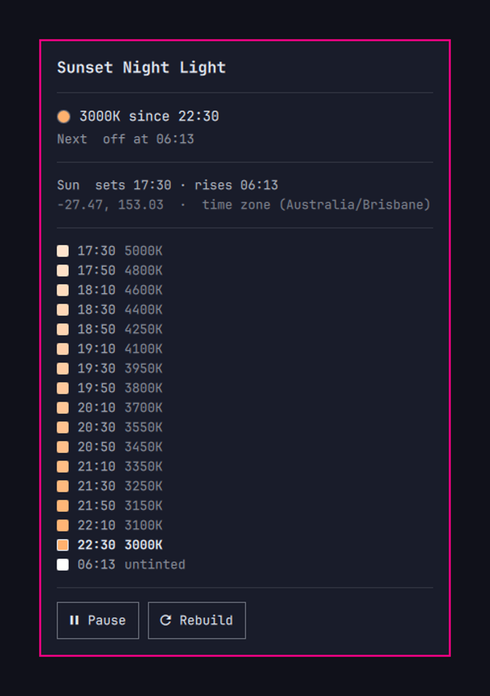

# Sunset Night Light



Warm the screen on a ramp anchored to **real local sunset**, deepening through the
evening, back to untinted at sunrise.

Omarchy's built-in night light is a switch: `Super + Ctrl + N` flips between 4000 K and
6500 K. hyprsunset can also follow the clock, but only the clock — its profiles key on a
fixed `HH:MM` and there is no interpolation between them. So an evening that gets
gradually warmer means a ladder of profiles, and a ladder anchored to sunset has to be
rebuilt as sunset moves. That is what this does.

```
17:30  5000K     sunset
17:50  4800K
18:10  4600K
   …
22:30  3000K     five hours later, at the floor
06:13  untinted  sunrise
```

## Location comes from your time zone

tzdata ships a representative latitude and longitude for every zone in
`zone1970.tab`, so `Australia/Brisbane` is enough to place you within a few kilometres —
far inside the minute or two of precision sunset timing needs. Change the system time
zone and the schedule follows, with no second thing to update.

Set `latitude` / `longitude` in the config if you want your actual coordinates.

## Install

Installing places files. It does not change your desktop, start anything, or
schedule anything — that happens only after you have seen exactly what it would
change and agreed to it.

```bash
git clone https://github.com/matt-shearing/omarchy-nightlight-auto
cd omarchy-nightlight-auto
./install.sh
```

`install.sh` symlinks the `nightlight-auto` CLI into `~/.local/bin`, links the plugin
into `~/.config/omarchy/plugins/`, adds the bar widget, and then hands over to
`nightlight-auto setup`, which prints the list below and waits for you to type `yes`:

- `~/.config/hypr/hyprsunset.conf` — replaced with a generated schedule. Whatever is
  there now is copied to `hyprsunset.conf.pre-nightlight-auto` first.
- `systemctl --user enable --now hyprsunset.service` — see
  [below](#hyprsunset-runs-from-systemd-not-autostartlua). Warns if `autostart.lua`
  already launches hyprsunset, since two launch paths race for its socket.
- `~/.config/systemd/user/nightlight-auto.{service,timer}` — the daily rebuild.
- `~/.config/omarchy/hooks/post-boot.d/nightlight-auto.sh` — rebuild at login.
- `~/.config/nightlight-auto/config.json` — created only if you do not have one.

Say no and nothing is written. Nothing under `/usr/share/omarchy` is touched at any
point, and nothing reaches the network.

Useful flags: `--place-only` stops after placing files, `--no-bar` skips the widget,
`--yes` accepts the changes without prompting.

### Installing from the marketplace

`omarchy plugin add https://github.com/matt-shearing/omarchy-nightlight-auto` clones and
enables the plugin without running `install.sh`, so it is inert: the widget appears and
its panel shows what setup would change, with a button to agree. Nothing is written until
you press it. To get the `nightlight-auto` command on your `PATH` as well, run
`./install.sh --place-only` from the cloned directory.

## Remove

```bash
nightlight-auto teardown
```

That undoes everything setup did: puts your original `hyprsunset.conf` back (or restores
Omarchy's default if you did not have one), disables and removes the timer and the
post-boot hook, and hands hyprsunset's launch back the way it found it. Your
`~/.config/nightlight-auto/config.json` is left alone.

Then remove the files:

```bash
rm -rf ~/.config/nightlight-auto ~/.local/state/nightlight-auto
rm -f ~/.local/bin/nightlight-auto
omarchy plugin remove contra.nightlight
```

If you added the indicator mark below, restore the original `NightLight.qml`.

## Use

```bash
nightlight-auto status         # what is on screen now, and what is next
nightlight-auto show           # tonight's whole ladder
nightlight-auto show --date 2026-12-21
nightlight-auto pause          # untinted until you resume
nightlight-auto resume
nightlight-auto generate       # rebuild now (the timer does this daily)
nightlight-auto setup --print  # what setup would change, without changing it
nightlight-auto teardown       # undo everything setup did
```

The bar widget shows the stage of the evening — a sun before the ramp starts, then a
setting sun, a crescent moon, and a new moon once it reaches the floor. Click it for
tonight's ladder with the current step marked, right-click to pause. It turns the urgent
colour only when hyprsunset is not running, because that is the one state where nothing
is being applied at all.

From a script or a keybinding:

```bash
omarchy-shell contra.nightlight status
omarchy-shell contra.nightlight pause | resume | toggle | rebuild
omarchy-shell shell toggle contra.nightlight    # open the panel
```

### Using the indicator instead of a bar widget

If you would rather not have a second night light icon, `indicators/NightLight.qml`
replaces the stock mark in the centre-bar indicator cluster with one that follows the
ramp. Clone the indicators widget, drop the file in, and leave this plugin out of the bar:

```bash
omarchy plugin clone omarchy.indicators
cp indicators/NightLight.qml ~/.config/omarchy/plugins/<you>.indicators/indicators/
omarchy restart shell
```

Then in `~/.config/omarchy/shell.json`, remove the `contra.nightlight` entry from
`bar.layout` and add `{ "id": "contra.nightlight" }` to the top-level `plugins` array —
that keeps the plugin enabled so its service still loads, without placing a widget.

Clicking pauses, clicking again resumes. The mark stays on screen while paused — an
inactive indicator is given `opacity: 0` and `interactive: false`, so a mark that hid
itself on pause would take the only control for undoing that with it. Paused is worth
seeing in daylight too: it says tonight's ramp will not run.

The mark falls back to the stock `omarchy.nightlight` toggle if this plugin is ever
disabled, so it keeps working either way.

## How this is different

[Set your Nightlight](https://github.com/Darksam08/Set-your-nightlight) is the closest
listed plugin and covers adjacent ground: it switches between a day and a night
temperature at manual times or at sunrise/sunset, with an optional transition of up to
120 minutes, all driven from buttons in the bar.

This one is shaped differently:

- **A ladder, not two states.** The evening keeps deepening in steps across a
  configurable window (five hours by default) rather than moving between a day value and
  a night value.
- **A CLI and a systemd timer**, not only bar buttons — so it is scriptable, bindable to
  a key, and works over SSH. The bar widget is optional; the schedule runs without it.
- **Location with nothing to configure.** Coordinates come from the system time zone via
  tzdata, so travelling and changing time zone moves the ramp with no second step.
- Steps are interpolated in mireds, and the solar math is covered by tests against
  published almanac times.

If you want to pick your own on and off times from the bar, theirs is the better fit.

## Configuration

`~/.config/nightlight-auto/config.json`:

| Key | Default | Meaning |
| --- | --- | --- |
| `latitude`, `longitude` | `null` | `null` derives both from the system time zone |
| `evening_temp` | `5000` | Kelvin at the start of the ramp |
| `night_temp` | `3000` | Kelvin at the deepest point |
| `day_temp` | `null` | `null` means untinted; a number tints the day too |
| `ramp_start_offset_min` | `0` | Minutes relative to sunset; negative starts earlier |
| `ramp_minutes` | `300` | How long the ramp takes to reach `night_temp` |
| `step_minutes` | `20` | Ladder granularity |
| `morning_offset_min` | `0` | Minutes relative to sunrise for the return to day |
| `fallback_sunset`, `fallback_sunrise` | `18:00`, `06:00` | Used only where the sun does not rise or set |
| `round_to_kelvin` | `50` | Rounds emitted temperatures, to keep the file readable |

Run `nightlight-auto generate` after editing. Temperatures are interpolated in **mireds**
(reciprocal megakelvin), not Kelvin, because even steps there are what read as an even
ramp to the eye — linear Kelvin steps crowd all the visible change into the warm end.

## How it fits into Omarchy

### Consent

Every write to your configuration goes through `generate`, and `generate` refuses to run
until a consent record exists at `~/.local/state/nightlight-auto/consent.json`. Only
`setup` creates that record, and only after printing the full list of changes and getting
a `yes`. The bar panel shows that same list — it renders `setup --print` verbatim, so the
text you agree to is the text that governs what happens.

The record also stores what was true beforehand — whether `hyprsunset.service` was already
enabled, where the old config was saved — so `teardown` can put things back rather than
guess. `tests/test_schedule.py` covers this directly: unconsented `generate` refuses,
`setup` without a terminal refuses, `--print` changes nothing, and setup followed by
teardown restores the original file byte for byte.

It writes `~/.config/hypr/hyprsunset.conf`, which is Omarchy's documented place for a
night light schedule. `omarchy toggle nightlight` still works and still wins — until the
next step in the ladder fires, at most `step_minutes` later. For a hold that lasts, use
`nightlight-auto pause`.

All state lives in a single `service` plugin. Bar widgets are instantiated once per
monitor and an indicator mark is instantiated twice over — active strip and hover
fold-out — so anything holding its own copy of the state would drift, and clicking one
copy would leave the others stale. The QML here is read-only; every side effect goes
through the one singleton.

### hyprsunset runs from systemd, not autostart.lua

The Omarchy manual suggests `o.launch_on_start("hyprsunset")`. This uses
`systemctl --user enable hyprsunset.service` instead — the unit the hyprsunset package
already ships — for a specific reason.

hyprsunset reads its config only at startup, so applying a rebuilt schedule means
restarting it. `omarchy-restart-app` relaunches through uwsm, which asks the user manager
for a transient scope. **A scope created from inside a systemd service does not outlive
that service.** Run from the timer, hyprsunset comes up, answers on its socket, and is
then killed the instant the oneshot exits — reproducibly, even after waiting for it to
confirm it is up. Restarting the unit has no such problem.

Running both launch paths would race for hyprsunset's socket, so there is only the one.
`install.sh` leaves the systemd unit enabled; if you also have the `autostart.lua` line,
remove it.

## Tests

```bash
python3 tests/test_schedule.py
```

Covers the solar math against published almanac times for Brisbane, London (across a DST
boundary), New York and Nairobi; polar day and polar night; the ladder's shape, ordering,
clamping and mired spacing; and the rendered config's structure.

## Requirements

Omarchy 4 (Quattro), `hyprsunset`, Python 3.9 or newer. No external Python packages and
no other dependencies — the solar calculation is stdlib arithmetic. `jq` and `systemd`
come with Omarchy.

## Licence

MIT — see [LICENSE](LICENSE).
